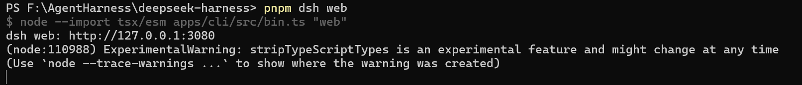
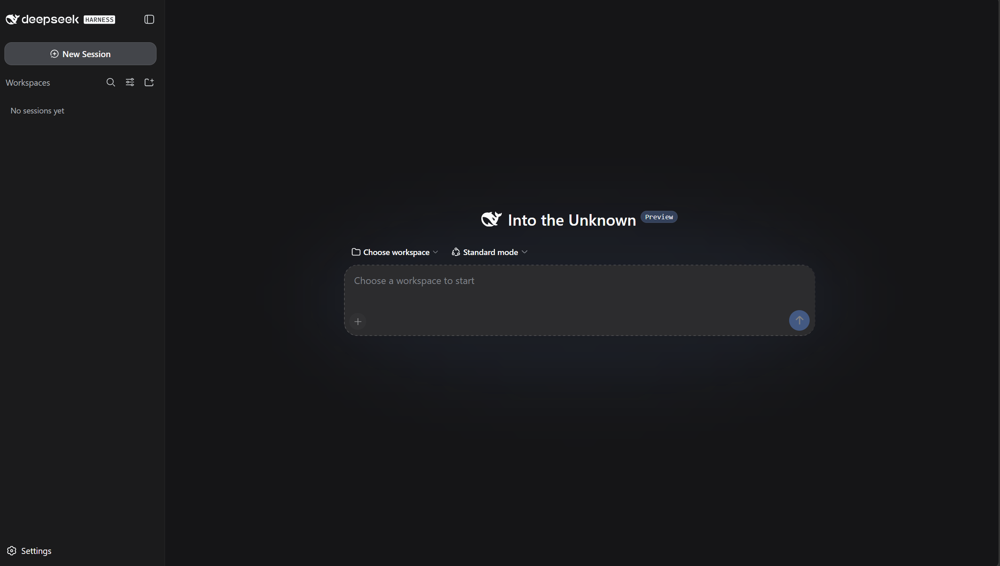
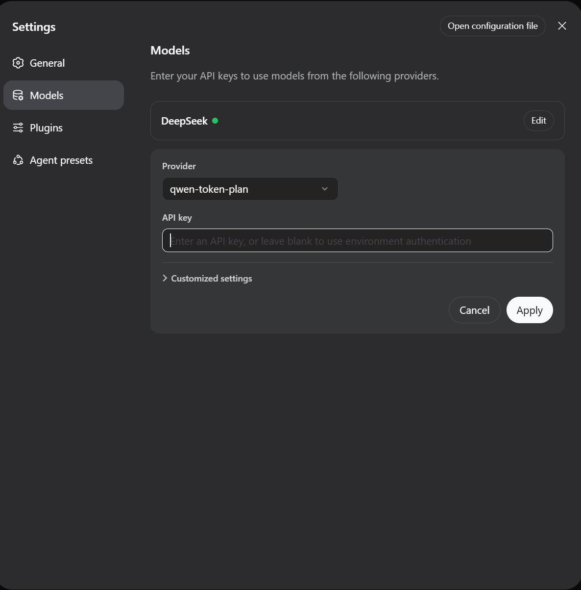
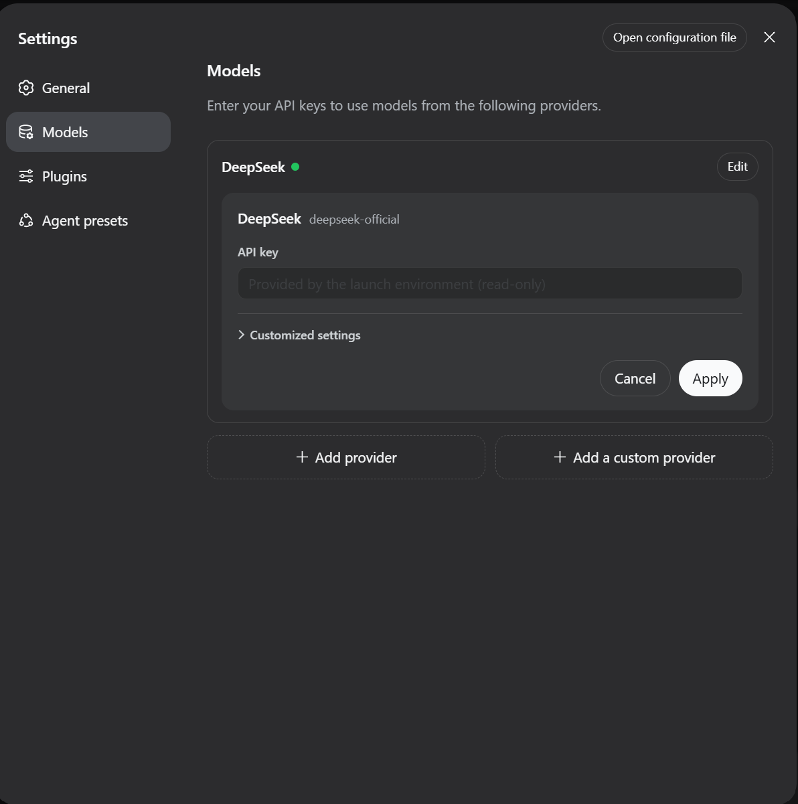
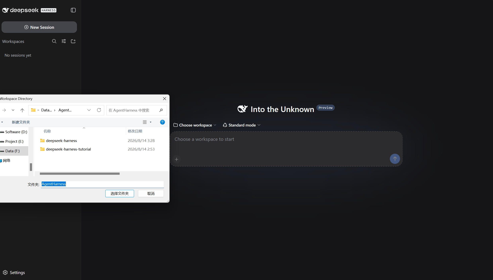
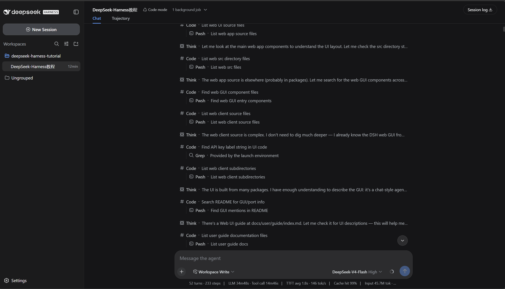

# DeepSeek Harness 教程

> 本教程由 **[Dataphany](https://dataphany.com)** 编写整理。
> Tutorial by **[Dataphany](https://dataphany.com)**.

> 🌐 **在线阅读 / Online Reading:** <https://dataphany.github.io/deepseek-harness-tutorial/>
>
> 本页为完整教程（上：中文版，下：English Version）。网页版支持中英切换、复制按钮与截图，体验更佳，建议访问上方网址。
> This page contains the full tutorial — Chinese above, English below. The interactive web version supports language switching, copy buttons, and screenshots; we recommend opening the URL above for the best experience.

📖 **[中文版](#中文版)** ｜ **[English](#english-version)**

---

## 中文版

### 一、DeepSeek Harness 是什么

**DeepSeek Harness**（简称 DSH）是 DeepSeek 开源的智能体开发框架，自带一个浏览器端的 **Web 图形界面**，默认运行在 `http://127.0.0.1:3080`。它相当于一个“带手的 AI 助手”：

- 💬 交互式对话：像聊天一样向 AI 下达任务；
- 🛠️ 工具调用：读写工作区文件、执行命令、搜索网络、委派子代理、维护计划；
- 🔐 权限审批：涉及敏感操作时会先询问你，操作透明可控；
- 📋 后台任务：长时间运行的任务可在后台执行并随时查看状态；
- 🧩 模型路由：支持 DeepSeek 官方 API，也支持 OpenAI 兼容端点与自定义 Provider。

本教程覆盖两部分内容：**① 在 Windows / macOS 上从零安装；② 界面使用教程（配截图与操作说明）**。

---

### 二、安装 DeepSeek Harness（Windows / macOS）

> 📌 **标识说明：** 带 **PowerShell** / **终端** 标识的代码块在对应平台的命令行中执行；带 **浏览器** 标识的操作在浏览器中完成；带 **文件资源管理器 / 访达** 标识的操作在系统的文件管理器中完成。

#### Windows

**准备工作**

**1. 安装 PowerShell 7**（如已安装可跳过）

在浏览器打开 <https://github.com/PowerShell/PowerShell/releases>，选择 `PowerShell-7.x.x-win-x64.msi` 下载，双击安装。

```powershell
pwsh --version   # 验证安装
```

**2. 安装 Git**

在浏览器打开 <https://git-scm.com/download/win>，下载后双击安装，一路 Next。

```powershell
git --version   # 验证安装
```

**3. 安装 Node.js LTS**

在浏览器打开 <https://nodejs.org/>，下载 LTS 版本 `.msi`，双击安装，一路 Next。

```powershell
node -v
npm -v
```

**4. 配置 DeepSeek API Key（永久写入系统变量）**

在浏览器打开 <https://platform.deepseek.com/> 登录，进入 API Keys 页面创建密钥。将下方命令中的 `sk-你的真实密钥` 替换为你的实际密钥：

```powershell
setx DEEPSEEK_API_KEY "sk-你的真实密钥"

# 重启 PowerShell 后验证
echo $env:DEEPSEEK_API_KEY
```

> 💡 也可以跳过环境变量方式，安装完成后直接在 Web 界面「设置 → 模型」里填入密钥。

**5. 安装 pnpm**

```powershell
npm install -g pnpm
```

**安装 DeepSeek Harness**

以下所有命令均在 **PowerShell** 中顺序执行：

**6. 克隆仓库**

```powershell
git clone https://github.com/deepseek-ai/deepseek-harness.git
```

**7. 进入项目目录**

```powershell
cd deepseek-harness
```

**8. 增加 Node.js 内存限制**（避免构建失败）

```powershell
$env:NODE_OPTIONS="--max-old-space-size=4096"
```

**9. 安装项目依赖**（此步骤可能耗时较长）

```powershell
pnpm install
```

**10. 构建项目**（此步骤可能耗时较长）

```powershell
pnpm run build
```

**启动使用**

**11. 启动 Web 界面**

```powershell
pnpm dsh web
```

**12. 在浏览器中打开以下地址**

```
http://127.0.0.1:3080
```

> 💡 **提示：** 设置面板中显示 **“Provided by the launch environment (read-only)”** 表示 API Key 已正确识别，可以直接使用。

#### macOS

**准备工作**

**1. 安装 Homebrew**（macOS 的包管理器，后续安装均依赖它）

```bash
/bin/bash -c "$(curl -fsSL https://raw.githubusercontent.com/Homebrew/install/HEAD/install.sh)"
```

**2. 安装 Git**

```bash
brew install git
git --version   # 验证安装
```

**3. 安装 Node.js LTS**（推荐使用 nvm）

```bash
curl -o- https://raw.githubusercontent.com/nvm-sh/nvm/v0.40.5/install.sh | bash   # 安装 nvm
source ~/.zshrc
nvm install --lts   # 安装最新的 LTS 版本
nvm use --lts       # 切换到该版本
node -v
npm -v
```

**4. 安装 PowerShell 7（可选，但推荐）**

```bash
brew install powershell/tap/powershell
pwsh --version   # 验证安装
```

**5. 配置 DeepSeek API Key（永久写入 shell 配置文件）**

在浏览器打开 <https://platform.deepseek.com/> 登录，进入 API Keys 页面创建密钥。将下方命令中的 `sk-你的真实密钥` 替换为你的实际密钥，写入 `~/.zshrc`：

```bash
echo 'export DEEPSEEK_API_KEY="sk-你的真实密钥"' >> ~/.zshrc
source ~/.zshrc
echo $DEEPSEEK_API_KEY   # 验证
```

**6. 安装 pnpm**（推荐使用 Homebrew）

```bash
brew install pnpm
pnpm --version   # 验证安装
```

**安装 DeepSeek Harness**

以下所有命令均在 **终端** 中顺序执行：

**7. 克隆仓库**

```bash
git clone https://github.com/deepseek-ai/deepseek-harness.git
```

**8. 进入项目目录**

```bash
cd deepseek-harness
```

**9. 增加 Node.js 内存限制**（避免构建失败）

```bash
export NODE_OPTIONS="--max-old-space-size=4096"
```

**10. 安装项目依赖**（此步骤可能耗时较长）

```bash
pnpm install
```

**11. 构建项目**（此步骤可能耗时较长）

```bash
pnpm run build
```

**启动使用**

**12. 启动 Web 界面**

```bash
pnpm dsh web
```

**13. 在浏览器中打开以下地址**

```
http://127.0.0.1:3080
```

> 💡 **提示：** 设置面板中显示 **“Provided by the launch environment (read-only)”** 表示 API Key 已正确识别，可以直接使用。

---

### 三、界面使用教程（配截图）

安装完成后，在浏览器打开 `http://127.0.0.1:3080` 即可看到 Web 界面，下面按使用顺序介绍界面的各个部分。

#### 3.1 启动与基础配置

1. **启动服务**：在终端执行 `pnpm dsh web`，看到输出 `dsh web: http://127.0.0.1:3080` 即启动成功，在浏览器中打开该地址。

<table align="center"><tr><td align="center" style="border: 3px solid #e6e9ee; border-radius: 6px; padding: 6px;"></td></tr></table>

2. **初始界面**：浏览器打开 `http://127.0.0.1:3080` 后的初始界面。首次使用需先配置模型密钥，再选择工作区，之后才能开始对话。

<table align="center"><tr><td align="center" style="border: 3px solid #e6e9ee; border-radius: 6px; padding: 6px;"></td></tr></table>

3. **配置模型**：打开「设置 → 模型」，在 DeepSeek 卡片中填入 API 密钥并保存，模型路由立即生效，无需重启服务。

<table align="center"><tr><td align="center" style="border: 3px solid #e6e9ee; border-radius: 6px; padding: 6px;"></td></tr></table>

4. **环境变量密钥**：若密钥由环境变量（`DEEPSEEK_API_KEY`）提供，设置面板显示 “Provided by the launch environment (read-only)”，表示已正确识别，可直接使用。

<table align="center"><tr><td align="center" style="border: 3px solid #e6e9ee; border-radius: 6px; padding: 6px;"></td></tr></table>

#### 3.2 工作区与主界面

1. **选择工作区**：点击「选择工作区」，添加并选中项目目录。选中后输入框才可用，agent 的文件读写都发生在这个工作区内。

<table align="center"><tr><td align="center" style="border: 3px solid #e6e9ee; border-radius: 6px; padding: 6px;"></td></tr></table>

2. **主界面**：主界面包含：会话与导航区、对话消息区（agent 的回复与工具调用在此展示）、底部输入框。输入任务后回车即可开始。

<table align="center"><tr><td align="center" style="border: 3px solid #e6e9ee; border-radius: 6px; padding: 6px;"></td></tr></table>

---

### 常见问题（FAQ）

- `git 不是内部或外部命令` / `git: command not found` → 未安装 Git，请回到安装章节的准备工作对应步骤。
- `node 不是内部或外部命令` / `node: command not found` → 未安装 Node.js 或未加载 nvm，请回到准备工作对应步骤。
- `pnpm: command not found` → 重新安装 pnpm：Windows 执行 `npm install -g pnpm`；macOS 执行 `brew install pnpm` 或 `npm install -g pnpm`。
- 构建时内存不足 → 确保已执行 `$env:NODE_OPTIONS="--max-old-space-size=4096"`（Windows）/ `export NODE_OPTIONS="--max-old-space-size=4096"`（macOS）。
- API Key 未被识别 → Windows 检查 `echo $env:DEEPSEEK_API_KEY`；macOS 检查 `echo $DEEPSEEK_API_KEY`；如未显示，重启终端后重试，或改用界面「设置 → 模型」直接填入密钥。
- 浏览器打开 `127.0.0.1:3080` 无响应 → 确认运行 `pnpm dsh web` 的窗口没有被关闭；查看启动输出是否出现 `dsh web: http://127.0.0.1:3080`。

---

### 📎 相关链接

- [DeepSeek Harness 官方仓库](https://github.com/deepseek-ai/deepseek-harness)
- 许可：[GPL-3.0](https://www.gnu.org/licenses/gpl-3.0.html)

---

---

## English Version

### 1. What is DeepSeek Harness?

**DeepSeek Harness** (DSH) is an open-source agent framework by DeepSeek. It ships with a browser-based **Web UI**, served by default at `http://127.0.0.1:3080` — an AI assistant with hands:

- 💬 Interactive chat to hand tasks to the AI;
- 🛠️ Tool use: read/write workspace files, run commands, search the web, delegate to subagents, and maintain plans;
- 🔐 Approval: sensitive operations ask you first — transparent and safe;
- 📋 Background jobs: run long tasks in the background and check status anytime;
- 🧩 Model routing: DeepSeek API, plus OpenAI-compatible endpoints and custom providers.

This tutorial covers: **① installing from scratch on Windows / macOS; ② a Web UI guide** with screenshots and instructions.

---

### 2. Install DeepSeek Harness (Windows / macOS)

> 📌 **Legend:** Blocks marked **PowerShell** / **Terminal** run in the command line of that platform; **Browser** actions happen in a web browser; **File Explorer / Finder** actions happen in the file manager.

#### Windows

**Preparation**

**1. Install PowerShell 7** (skip if already installed)

Open <https://github.com/PowerShell/PowerShell/releases> in your browser, download `PowerShell-7.x.x-win-x64.msi` and double-click to install.

```powershell
pwsh --version   # verify
```

**2. Install Git**

Open <https://git-scm.com/download/win>, download the installer and click Next all the way through.

```powershell
git --version   # verify
```

**3. Install Node.js LTS**

Open <https://nodejs.org/>, download the LTS `.msi` and install.

```powershell
node -v
npm -v
```

**4. Set up your DeepSeek API Key (persistently, via environment variable)**

Open <https://platform.deepseek.com/>, sign in, and create a key on the API Keys page. Replace `sk-your-real-key` below with your actual key:

```powershell
setx DEEPSEEK_API_KEY "sk-your-real-key"

# Restart PowerShell to verify
echo $env:DEEPSEEK_API_KEY
```

> 💡 You can also skip the environment variable and enter the key later in the Web UI under Settings → Models.

**5. Install pnpm**

```powershell
npm install -g pnpm
```

**Install DeepSeek Harness**

Run the following commands in order in **PowerShell**:

**6. Clone the repository**

```powershell
git clone https://github.com/deepseek-ai/deepseek-harness.git
```

**7. Enter the project directory**

```powershell
cd deepseek-harness
```

**8. Increase the Node.js memory limit** (to avoid build failures)

```powershell
$env:NODE_OPTIONS="--max-old-space-size=4096"
```

**9. Install project dependencies** (this may take a while)

```powershell
pnpm install
```

**10. Build the project** (this may take a while)

```powershell
pnpm run build
```

**Launch**

**11. Start the Web UI**

```powershell
pnpm dsh web
```

**12. Open the following address in your browser**

```
http://127.0.0.1:3080
```

> 💡 **Tip:** If the settings panel shows **“Provided by the launch environment (read-only)”**, your API Key was detected and is ready to use.

#### macOS

**Preparation**

**1. Install Homebrew** (the macOS package manager; later steps depend on it)

```bash
/bin/bash -c "$(curl -fsSL https://raw.githubusercontent.com/Homebrew/install/HEAD/install.sh)"
```

**2. Install Git**

```bash
brew install git
git --version   # verify
```

**3. Install Node.js LTS** (nvm recommended)

```bash
curl -o- https://raw.githubusercontent.com/nvm-sh/nvm/v0.40.5/install.sh | bash   # install nvm
source ~/.zshrc
nvm install --lts   # install latest LTS
nvm use --lts       # switch to it
node -v
npm -v
```

**4. Install PowerShell 7 (optional but recommended)**

```bash
brew install powershell/tap/powershell
pwsh --version   # verify
```

**5. Set up your DeepSeek API Key (persistently, in your shell config)**

Open <https://platform.deepseek.com/>, sign in, and create a key. Replace `sk-your-real-key` below with your actual key, then write it to `~/.zshrc`:

```bash
echo 'export DEEPSEEK_API_KEY="sk-your-real-key"' >> ~/.zshrc
source ~/.zshrc
echo $DEEPSEEK_API_KEY   # verify
```

**6. Install pnpm** (recommended: via Homebrew)

```bash
brew install pnpm
pnpm --version   # verify
```

**Install DeepSeek Harness**

Run the following commands in order in **Terminal**:

**7. Clone the repository**

```bash
git clone https://github.com/deepseek-ai/deepseek-harness.git
```

**8. Enter the project directory**

```bash
cd deepseek-harness
```

**9. Increase the Node.js memory limit** (to avoid build failures)

```bash
export NODE_OPTIONS="--max-old-space-size=4096"
```

**10. Install project dependencies** (this may take a while)

```bash
pnpm install
```

**11. Build the project** (this may take a while)

```bash
pnpm run build
```

**Launch**

**12. Start the Web UI**

```bash
pnpm dsh web
```

**13. Open the following address in your browser**

```
http://127.0.0.1:3080
```

> 💡 **Tip:** If the settings panel shows **“Provided by the launch environment (read-only)”**, your API Key was detected and is ready to use.

---

### 3. Web UI Guide

After installation, open `http://127.0.0.1:3080` in your browser to see the Web UI. Here is a walkthrough of its parts in order of use.

#### 3.1 Startup & Basic Setup

1. **Start the service**: Run `pnpm dsh web` in the terminal. When you see `dsh web: http://127.0.0.1:3080` in the output, it started successfully — open that address in your browser.

<table align="center"><tr><td align="center" style="border: 3px solid #e6e9ee; border-radius: 6px; padding: 6px;"></td></tr></table>

2. **Initial screen**: After opening `http://127.0.0.1:3080`, on first use configure your model API key, then select a workspace before starting a conversation.

<table align="center"><tr><td align="center" style="border: 3px solid #e6e9ee; border-radius: 6px; padding: 6px;"></td></tr></table>

3. **Configure models**: Open Settings → Models, enter your API key in the DeepSeek card and save. The model route is effective immediately — no server restart needed.

<table align="center"><tr><td align="center" style="border: 3px solid #e6e9ee; border-radius: 6px; padding: 6px;"></td></tr></table>

4. **Environment-provided key**: If your key comes from an environment variable (`DEEPSEEK_API_KEY`), the settings panel shows “Provided by the launch environment (read-only)” — recognized and ready to use.

<table align="center"><tr><td align="center" style="border: 3px solid #e6e9ee; border-radius: 6px; padding: 6px;"></td></tr></table>

#### 3.2 Workspace & Main Layout

1. **Select workspace**: Click Select Workspace to add and select a project directory. The input box is enabled only after selecting one; the agent operates on files within this workspace.

<table align="center"><tr><td align="center" style="border: 3px solid #e6e9ee; border-radius: 6px; padding: 6px;"></td></tr></table>

2. **Main layout**: session/navigation area, message area (agent replies and tool calls), and an input box at the bottom. Type a task and press Enter to begin.

<table align="center"><tr><td align="center" style="border: 3px solid #e6e9ee; border-radius: 6px; padding: 6px;"></td></tr></table>

---

### FAQ

- `git is not recognized` / `git: command not found` → Git is not installed; go back to the corresponding Preparation step.
- `node is not recognized` / `node: command not found` → Node.js is not installed or nvm is not loaded.
- `pnpm: command not found` → Reinstall pnpm: `npm install -g pnpm` on Windows; `brew install pnpm` or `npm install -g pnpm` on macOS.
- Out of memory during build → make sure you ran `$env:NODE_OPTIONS="--max-old-space-size=4096"` (Windows) or `export NODE_OPTIONS="--max-old-space-size=4096"` (macOS).
- API Key not recognized → check `echo $env:DEEPSEEK_API_KEY` on Windows or `echo $DEEPSEEK_API_KEY` on macOS; if empty, restart the terminal and retry, or enter the key directly in Settings → Models.
- The page at `127.0.0.1:3080` doesn't respond → make sure the window running `pnpm dsh web` is still open, and check that the startup output shows `dsh web: http://127.0.0.1:3080`.

---

### 📎 Links

- [DeepSeek Harness official repository](https://github.com/deepseek-ai/deepseek-harness)
- License: [GPL-3.0](https://www.gnu.org/licenses/gpl-3.0.html)
